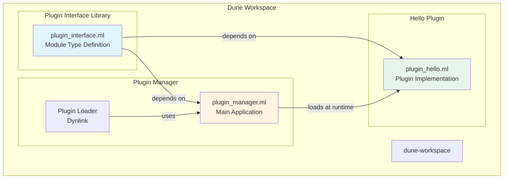

# Design Document

## Overview

OCaml의 Dynlink 모듈을 활용한 동적 플러그인 시스템을 설계합니다. 시스템은 세 가지 주요 컴포넌트로 구성됩니다:

1. **plugin_interface**: 플러그인 인터페이스를 정의하는 공유 라이브러리
2. **plugin_manager**: 플러그인을 로드하고 실행하는 메인 애플리케이션
3. **plugin_hello**: 데모 플러그인 구현

모든 컴포넌트는 Dune workspace 구조로 관리되며, 각각 독립적으로 빌드 가능합니다.

## Architecture



### Directory Structure

```
workspace_root/
├── dune-workspace          # Workspace configuration
├── dune-project            # Project metadata
├── README.md               # Documentation
├── plugin_interface/       # Shared interface library
│   ├── dune
│   └── plugin_interface.ml
├── plugin_manager/               # Main application
│   ├── dune
│   └── plugin_manager.ml
└── plugin_hello/           # Demo plugin
    ├── dune
    └── plugin_hello.ml
```

## Components and Interfaces

### 1. Plugin Interface Library

**Purpose**: 플러그인과 코어 애플리케이션 간의 계약을 정의합니다.

**Module**: `plugin_interface.ml`

```ocaml
module type PLUGIN = sig
  val name : unit -> string
  val execute : unit -> unit
end
```

**Design Decisions**:
- Module type을 사용하여 컴파일 타임 타입 안전성 보장
- 단순한 인터페이스로 플러그인 구현 복잡도 최소화
- `name`: 플러그인 식별을 위한 메타데이터
- `execute`: 플러그인의 주요 로직 실행

**Dune Configuration**:
```lisp
(library
 (name plugin_interface)
 (modules plugin_interface))
```

### 2. Plugin Manager

**Purpose**: 플러그인을 동적으로 로드하고 실행하는 메인 애플리케이션입니다.

**Module**: `plugin_manager.ml`

**Key Functions**:

1. **load_plugin**: 플러그인 파일을 동적으로 로드
   - Dynlink.loadfile을 사용하여 .cmxs 파일 로드
   - 에러 처리: 파일 없음, 로딩 실패 등

2. **execute_plugin**: 로드된 플러그인 실행
   - 플러그인 모듈을 Plugin_interface.PLUGIN 타입으로 캐스팅
   - name() 호출하여 플러그인 이름 출력
   - execute() 호출하여 플러그인 로직 실행

3. **main**: 프로그램 진입점
   - 커맨드 라인 인자로 플러그인 경로 받기
   - 플러그인 로드 및 실행 오케스트레이션

**Design Decisions**:
- Dynlink 모듈 사용: OCaml의 표준 동적 로딩 메커니즘
- 명령줄 인자로 플러그인 경로 지정: 유연성 제공
- 예외 처리를 통한 안정성 확보
- First-class modules를 사용하여 동적 모듈을 타입 안전하게 처리

**Dune Configuration**:
```lisp
(executable
 (name plugin_manager)
 (modules plugin_manager)
 (libraries plugin_interface dynlink))
```

### 3. Hello Plugin

**Purpose**: 플러그인 시스템의 동작을 검증하는 데모 플러그인입니다.

**Module**: `plugin_hello.ml`

**Implementation**:
```ocaml
let name () = "plugin_hello"

let execute () =
  print_endline "Hello, OCaml!"

(* Register as plugin *)
let () =
  Dynlink.Plugin.register "plugin_hello" 
    (module struct
      let name = name
      let execute = execute
    end : Plugin_interface.PLUGIN)
```

**Design Decisions**:
- Plugin_interface.PLUGIN 인터페이스 구현
- 간단한 출력 기능으로 검증 용이성 확보
- Dynlink.Plugin.register를 통한 플러그인 등록

**Dune Configuration**:
```lisp
(library
 (name plugin_hello)
 (modules plugin_hello)
 (libraries plugin_interface)
 (modes plugin))
```

**Key Point**: `(modes plugin)` 설정으로 .cmxs 파일 생성

## Data Models

### Plugin Registry

플러그인 등록 및 관리를 위한 간단한 구조:

```ocaml
(* Core application에서 관리 *)
type plugin_info = {
  name: string;
  module_ref: (module Plugin_interface.PLUGIN)
}
```

런타임에 로드된 플러그인은 first-class module로 관리됩니다.

## Error Handling

### Error Types

1. **File Not Found**: 플러그인 파일이 존재하지 않음
   - 처리: 명확한 에러 메시지 출력 후 종료

2. **Loading Error**: Dynlink 로딩 실패
   - 처리: Dynlink.Error 예외 캐치 및 상세 에러 출력

3. **Execution Error**: 플러그인 실행 중 예외 발생
   - 처리: 예외 캐치 및 로깅, 애플리케이션은 계속 실행

### Error Handling Strategy

```ocaml
try
  Dynlink.loadfile plugin_path;
  (* execute plugin *)
with
| Dynlink.Error err ->
    Printf.eprintf "Failed to load plugin: %s\n" 
      (Dynlink.error_message err);
    exit 1
| Sys_error msg ->
    Printf.eprintf "System error: %s\n" msg;
    exit 1
| e ->
    Printf.eprintf "Unexpected error: %s\n" 
      (Printexc.to_string e);
    exit 1
```

## Build System Configuration

### Dune Workspace

**File**: `dune-workspace`

```lisp
(lang dune 3.20)

(context
 (default
  (name default)))
```

### Dune Project

**File**: `dune-project`

```lisp
(lang dune 3.20)
(name ocaml_plugin_system)
```

### Build Process

1. **Build all components**:
   ```bash
   dune build
   ```

2. **Build artifacts locations**:
   - Core app: `_build/default/plugin_manager/plugin_manager.exe`
   - Hello plugin: `_build/default/plugin_hello/plugin_hello.cmxs`

3. **Run with plugin**:
   ```bash
   dune exec plugin_manager/plugin_manager.exe -- _build/default/plugin_hello/plugin_hello.cmxs
   ```

## Testing Strategy

### Unit Testing

각 컴포넌트의 기본 기능 검증:

1. **Plugin Interface**: 타입 정의 검증 (컴파일 타임)
2. **Hello Plugin**: 
   - name() 함수가 올바른 문자열 반환
   - execute() 함수가 예상된 출력 생성

### Integration Testing

전체 시스템 동작 검증:

1. **Plugin Loading Test**:
   - 유효한 플러그인 파일 로드 성공
   - 존재하지 않는 파일 로드 시 적절한 에러

2. **Plugin Execution Test**:
   - 로드된 플러그인이 올바르게 실행
   - 플러그인 이름이 올바르게 출력

3. **End-to-End Test**:
   - 커맨드 라인에서 전체 워크플로우 실행
   - 예상된 출력 확인

### Manual Testing

```bash
# Build the workspace
dune build

# Run core app with hello plugin
dune exec plugin_manager/plugin_manager.exe -- _build/default/plugin_hello/plugin_hello.cmxs

# Expected output:
# Loading plugin: plugin_hello
# Hello, OCaml!
```

## Extension Points

### Adding New Plugins

새로운 플러그인 추가 프로세스:

1. 새 디렉토리 생성 (예: `my_plugin/`)
2. `my_plugin.ml` 파일 작성:
   ```ocaml
   let name () = "my_plugin"
   let execute () = (* custom logic *)
   
   let () = Dynlink.Plugin.register "my_plugin"
     (module struct
       let name = name
       let execute = execute
     end : Plugin_interface.PLUGIN)
   ```
3. `dune` 파일 작성:
   ```lisp
   (library
    (name my_plugin)
    (modules my_plugin)
    (libraries plugin_interface)
    (modes plugin))
   ```
4. 빌드 및 실행

### Future Enhancements

1. **Plugin Discovery**: 디렉토리에서 자동으로 플러그인 검색
2. **Plugin Configuration**: 설정 파일을 통한 플러그인 파라미터 전달
3. **Plugin Dependencies**: 플러그인 간 의존성 관리
4. **Hot Reloading**: 런타임에 플러그인 재로드
5. **Plugin Versioning**: 버전 호환성 체크

## Security Considerations

1. **Code Injection**: Dynlink는 임의의 코드 실행 가능
   - 신뢰할 수 있는 플러그인만 로드
   - 플러그인 서명 검증 고려 (향후)

2. **Resource Limits**: 플러그인의 리소스 사용 제한 없음
   - 향후 샌드박싱 고려

3. **Error Isolation**: 플러그인 에러가 메인 앱에 영향
   - 예외 처리로 부분적 격리
